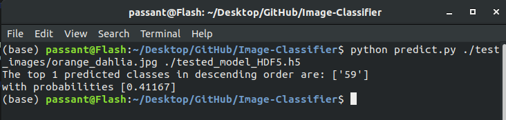
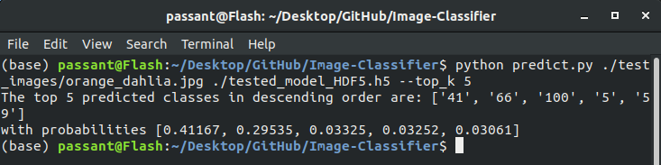
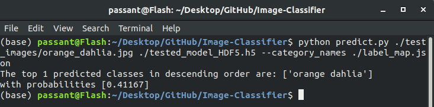

# Image-Classifier Project

Second project in `Intro to Machine Learning with TensorFlow` nano degree on udacity, with a notebook goes through the training &amp; evaluation processes and a CLI Application to use for classifying flowers. this model is trained using TensorFlow oxford flowers dataset.

**NOTE**: It's preferred NOT to run the training cell if you don't have GPU

## Installation
This project uses TensoFlow2.
- run the following command in your terminal to install all required libraries
```bash
pip install -r requirements.txt
```
or
```bash
pip install -r requirements.txt -q
```
to hide the installation progress
- If you don't have GPU, consider using [Google colab](https://colab.research.google.com/notebooks/intro.ipynb#recent=true)
## Open the Notebook
In a terminal or command window, navigate to the top-level project directory Image-Classifier/ and run one of the following commands:

```bash
jupyter notebook Image_Classifier_Project.ipynb
```

## CLI Application
A Python script that runs from the command line / terminal.
**Basic Usage**
```bash
python predict.py /path/to/image saved_model
```
Note: the saved_model file name in the directory is `tested_model_HDF5.h5`
**Options**
- --top_k: returns the top K most likely classes.
```bash
python predict.py /path/to/image saved_model --top_k K
```
-  --category_names: Path to a JSON file mapping labels to flower names.
```bash
python predict.py /path/to/image saved_model --category_names map.json
```
Note: the json file name in the directory is `label_map.json`
## Testing CLI Application

There is a folder with 4 images in the same directory you can use for testing, called `test_images`

**Basic**:
```bash
python predict.py ./test_images/orange_dahlia.jpg ./tested_model_HDF5.h5
```


**Top k**
```bash
python predict.py ./test_images/orange_dahlia.jpg ./tested_model_HDF5.h5 --top_k 5
```


**JSON file**
```bash
python predict.py ./test_images/orange_dahlia.jpg ./tested_model_HDF5.h5 --category_names ./label_map.json
```


## Data
The data for this project is quite large, it's oxford flowers dataset with 102 different types of flowers. with 1020 examples for training, 1020 examples for validation, and 6149 examples for testing.


